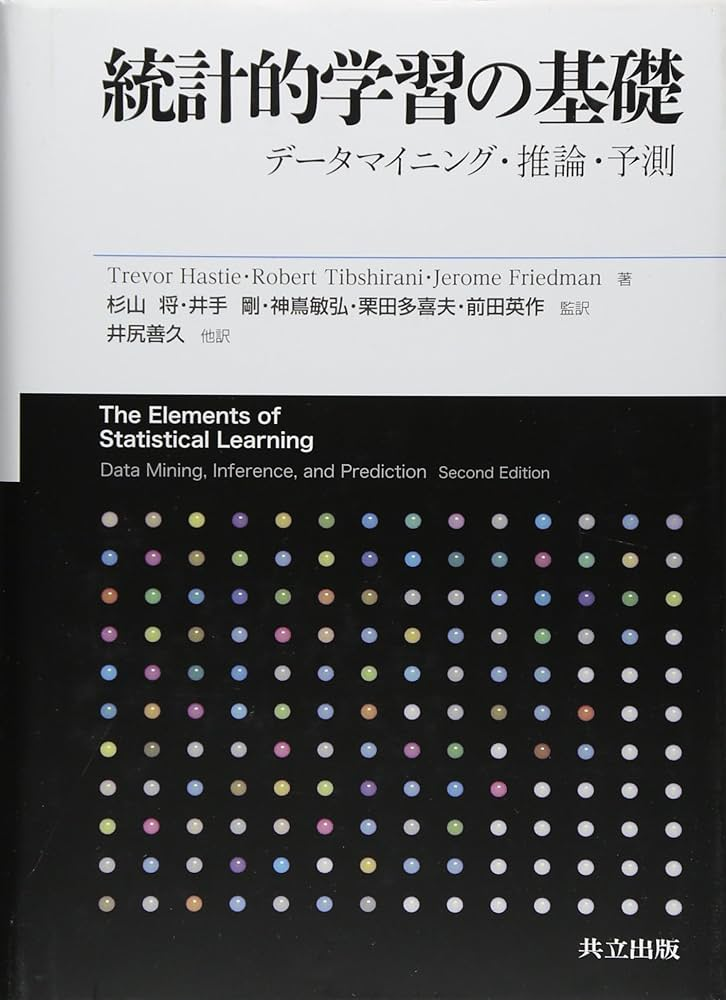

# [READLOG] The Elements of Statistical Learning (translated in Japanese)

This repository is a reading record for the Japanese version of "The Elements of Statistical Learning"(統計的学習の基礎). I use it to organize my personal learning and thoughts to knowledge.

[Amazon 統計的学習の基礎](https://www.amazon.co.jp/%E7%B5%B1%E8%A8%88%E7%9A%84%E5%AD%A6%E7%BF%92%E3%81%AE%E5%9F%BA%E7%A4%8E-%E2%80%95%E3%83%87%E3%83%BC%E3%82%BF%E3%83%9E%E3%82%A4%E3%83%8B%E3%83%B3%E3%82%B0%E3%83%BB%E6%8E%A8%E8%AB%96%E3%83%BB%E4%BA%88%E6%B8%AC%E2%80%95-Trevor-Hastie/dp/432012362X)

## Progress
:white_check_mark::white_medium_square::white_medium_square::white_medium_square::white_medium_square::white_medium_square::white_medium_square::white_medium_square::white_medium_square::white_medium_square::white_medium_square::white_medium_square::white_medium_square::white_medium_square::white_medium_square::white_medium_square::white_medium_square::white_medium_square::white_medium_square: 1%

## Index
1. :white_check_mark:[序章](Chapter_01/序章.md)
2. 教師あり学習の概要
    2.1. 導入

## Data
[Data](https://hastie.su.domains/ElemStatLearn/)

